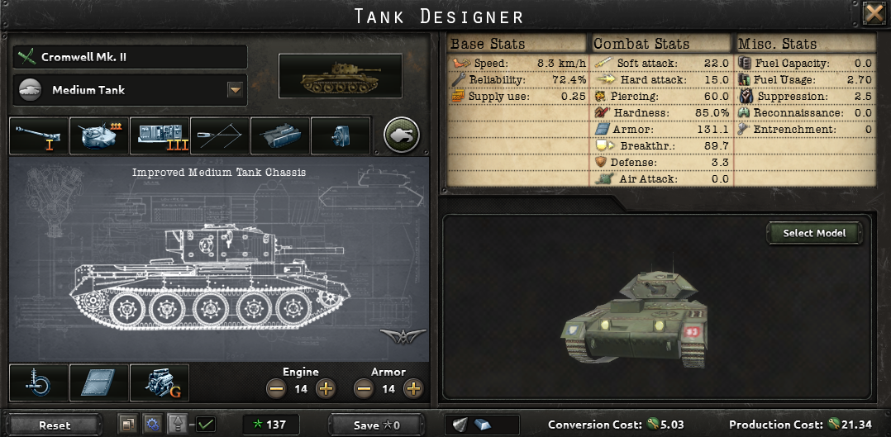
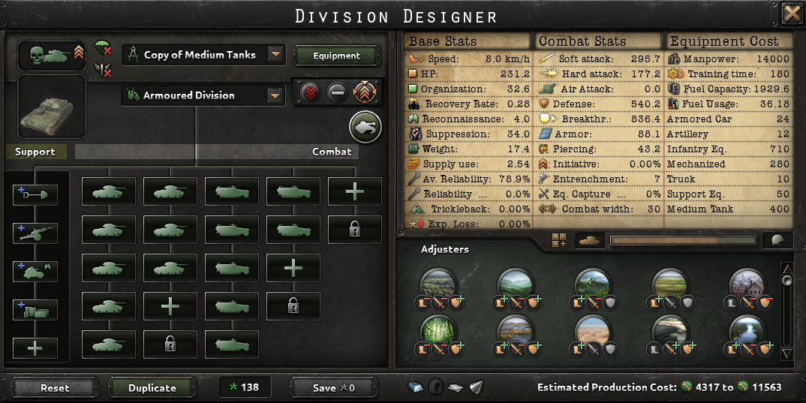
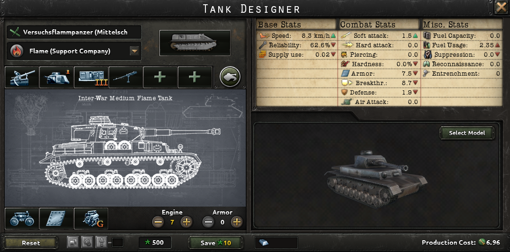
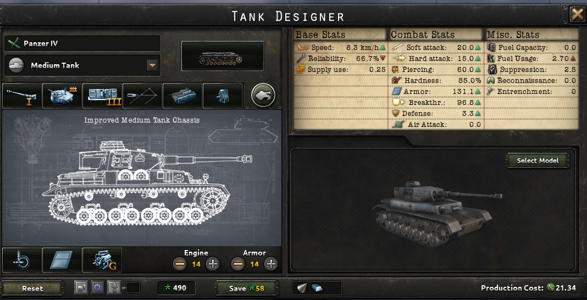
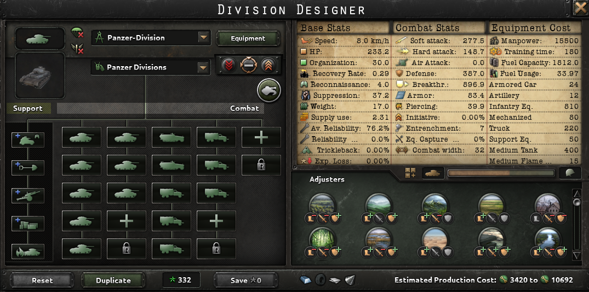
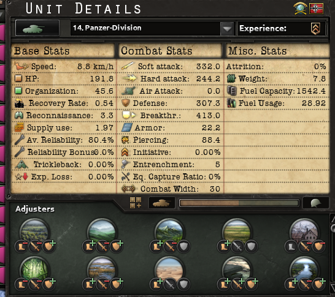
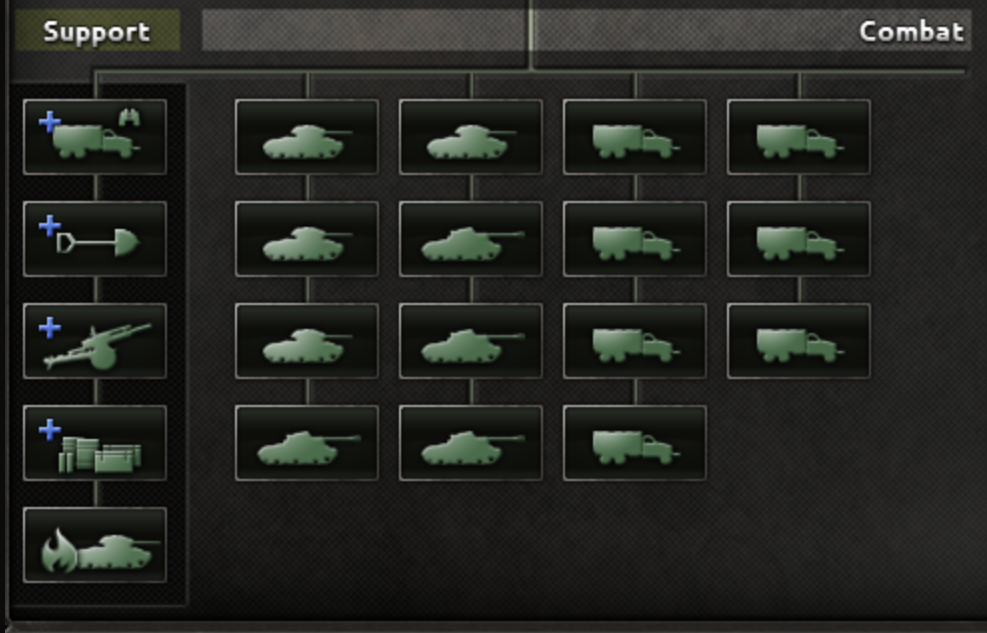

# Medium Tanks

## Nils Cromwells

HoI4 Version 1.11

<figure><figcaption>
Medium Tank Design
</figcaption></figure>

<figure><figcaption>
Division Template
</figcaption></figure>

## Flame Cromwells

HoI4 Version 1.11

A 1940 Design. Upgrade to Nils Cromwell Design with a Flame Tank for an additional Attack Bonus.

Replace Motorized with Mechanized.

<figure><figcaption>
Flame Tank Design
</figcaption></figure>

<figure><figcaption>
Medium Tank Design
</figcaption></figure>

<figure><figcaption>
Division Template
</figcaption></figure>

## Max' Tank Division

<figure><figcaption></figcaption></figure>

<figure><figcaption>
Template
</figcaption></figure>
