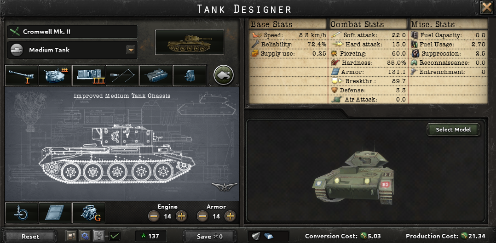
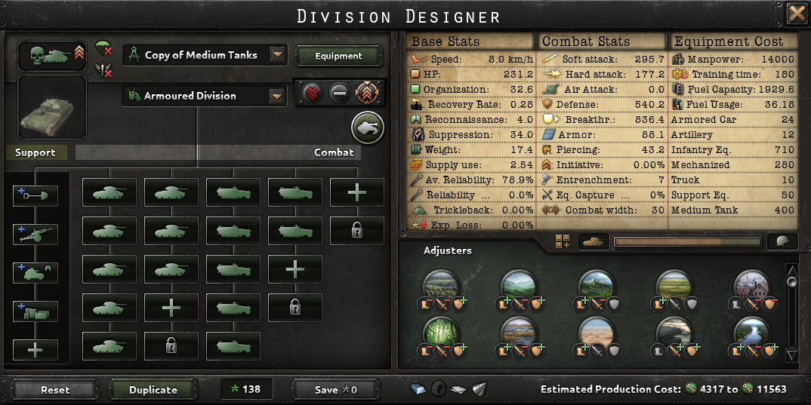
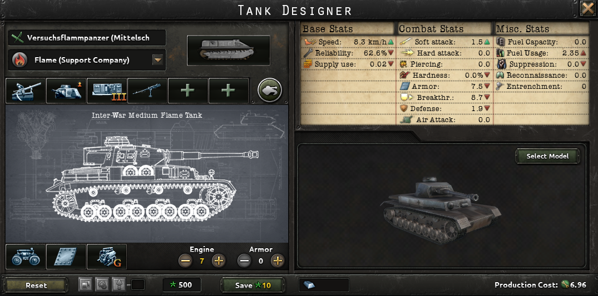
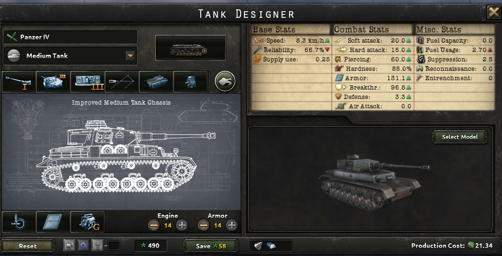
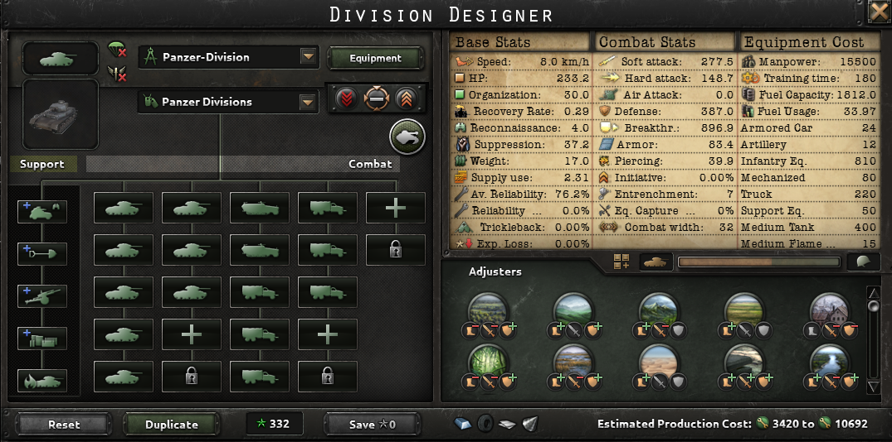
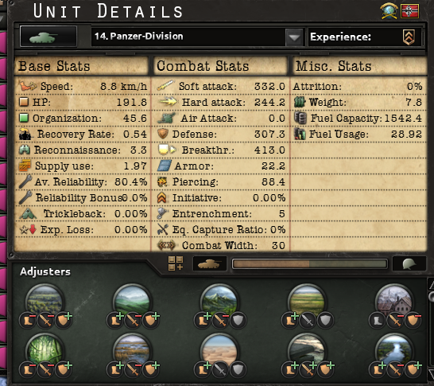
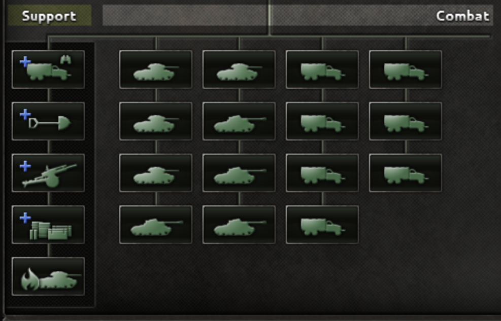

# Medium Tanks

## Version 1.11

Should still be good for 1.12.

### Nils Cromwells

<figure><figcaption>
Medium Tank Design
</figcaption></figure>

<figure><figcaption>
Division Template
</figcaption></figure>

### Flame Cromwells

A 1940 Design. Upgrade to Nils Cromwell Design with a Flame Tank for an additional Attack Bonus.

Replace Motorized with Mechanized.

<figure><figcaption>
Flame Tank Design
</figcaption></figure>

<figure><figcaption>
Medium Tank Design
</figcaption></figure>

<figure><figcaption>
Division Template
</figcaption></figure>

### Max' Tank Division

<figure><figcaption>
Stats
</figcaption></figure>

<figure><figcaption>
Template
</figcaption></figure>
