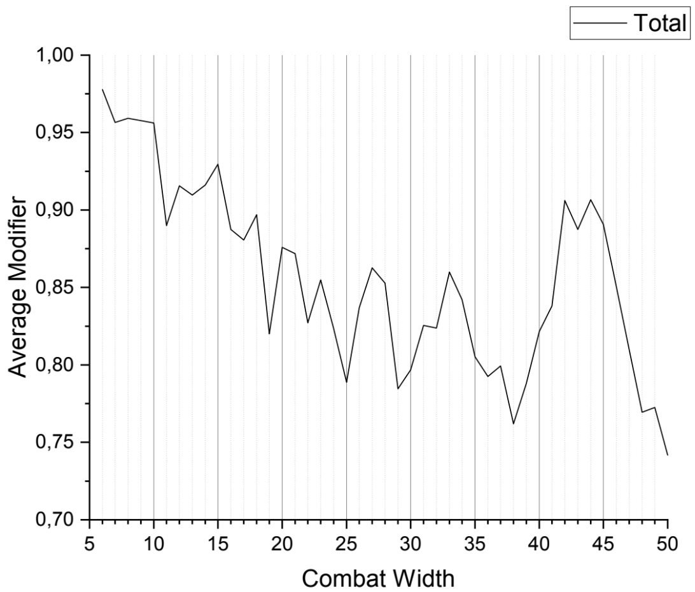

# Combat Width

The effectiveness of a Combat Width depends on the Theatre but I'll ignore the
differences. Fabricensis[\[Fabr2021\]][Fabr2021] goes into more detail
regarding these differences in his report on Combat Widths.

Furthermore he concludes,

> 10 widths are on paper the best divisions. However it is difficult to balance
> their stats, especially with support companies. For small countries however,
> it is very viable to build up a small military with many low width divisions.
>
> 27 seems to be the best rounded width in the medium range, 25 should be
> avoided.
>
> If you can afford the industrial and supply cost, 41 to 45 is a high plateau,
> leading to some wiggle room.
>
> All in all, the differences between different widths are quite small, so it
> can still be a good strategy to build specialized divisions, like 30 or 45
> width tanks or 25 width mountaineers

[\[Fabr2021\]][Fabr2021]

## References

- \[Fabr2021] Fabricensis (2021, December 19), _Evaluation of different unit
  combat widths in Hearts of Iron 4 following patch 1.11 ’Barbarossa’_,
  Accessed on  Dec. 6, 2021. [Online][Fabr2021]

[Fabr2021]: <https://www.dropbox.com/sh/fkdpyptpr93qw0a/AACoG263xuHLGjVQR-C_mAsha?dl=0&preview=CW_meta.pdf> "Evaluation of different unit combat widths in Hearts of Iron 4 following patch 1.11 ’Barbarossa’"
